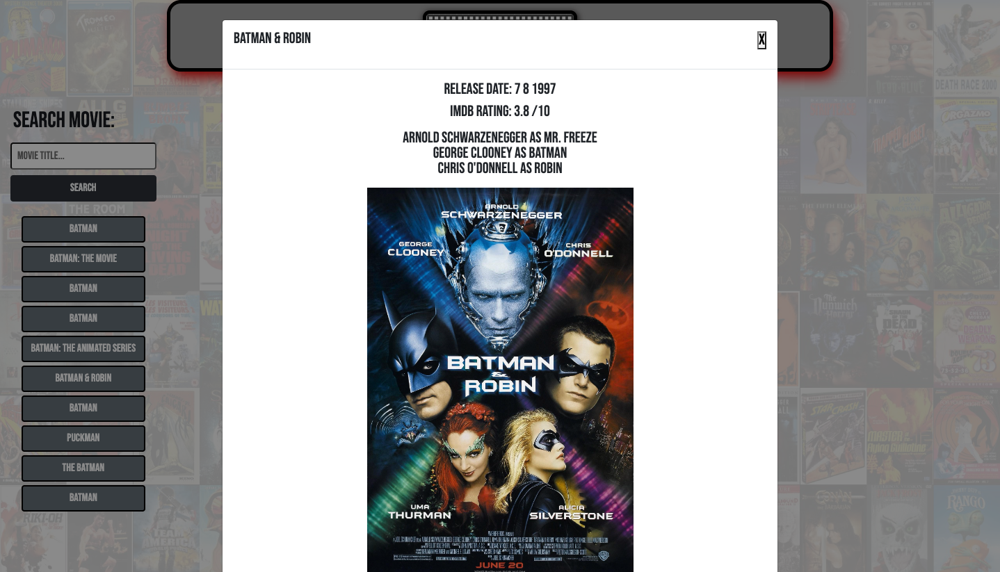

# Flix-Fiend

## Description 

Flix Fiend app was built for the movie lover who wants to save and view their favorite titles from past to present.
From the search field the user is given a brief preview which includes title, imdb rating, main actors, and theatrical 
movie poster. With this project we used a combination of bootstrap, javascript, css, and modal for a quick pop-up 
preview. All movie information is coming from 2 separate API's using the fetch method to display any given title
desired. From this build, you can learn how to fetch and dynamically display any information to a webpage along
with the use of bootstrap and css for app design.

## Link to app

[Deploy Application][def]

[def]: ""